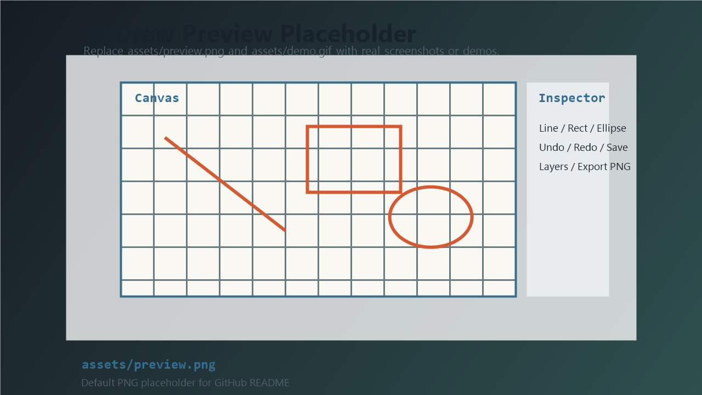
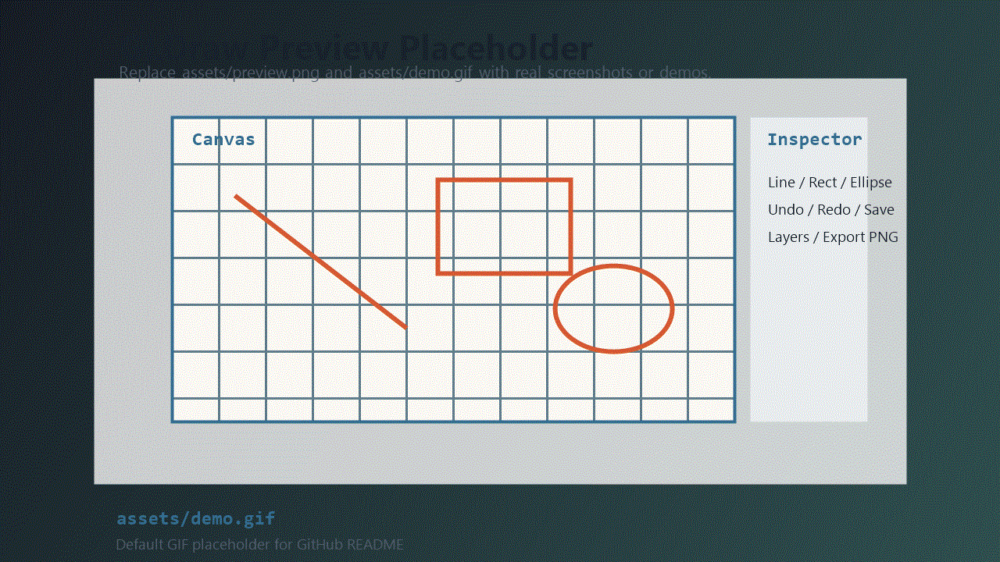

# GLDraw

English | [简体中文](README.zh-CN.md)

A canvas-centered OpenGL drawing editor built in C11.




Animated placeholder:


## Project Status

Active development.

Current focus:

- editor workflow refinement
- extension-system growth
- rendering and UX polish
- deeper test coverage around command and workspace behavior

## Highlights

- Canvas-oriented 2D editing workflow with world-space document geometry
- C11 codebase built on GLFW, GLAD, Nuklear, and OpenGL 3.3 Core Profile
- Command-based undo/redo with merge and transaction support
- Descriptor-driven object and tool extension model
- JSON document persistence and PNG export
- Layer-aware editing with visibility, lock, rename, and reorder flows

## Quick Start

### Linux / macOS

```sh
./build.sh
./build/Release/bin/GLDraw
```

### Windows (MinGW/MSYS2, CMD)

```bat
build.bat
build\Release\bin\GLDraw.exe
```

More build options and platform notes:
[doc/user/getting-started.md](doc/user/getting-started.md)

## Current Features

- Line, rectangle, and ellipse tools
- Select, move, pan, zoom, and zoom-to-fit flows
- Inspector-based property editing
- Layer creation, activation, visibility, lock, rename, and reorder controls
- Save/load through JSON persistence
- Undo/redo through `CommandExecutor`
- PNG export from the current render path

## Controls

`V` Select, `H` Pan, `L` Line, `R` Rectangle, `E` Ellipse  
`Ctrl+Z` Undo, `Ctrl+Y` / `Ctrl+Shift+Z` Redo  
`Ctrl+S` Save, `Ctrl+O` Open

Full controls:
[doc/user/controls.md](doc/user/controls.md)

## Architecture

GLDraw is organized around `Workspace`:

```text
Workspace
  -> EditorCore
  -> EditorSession
  -> EditorServices
```

Key runtime traits:

- `EditorCore` owns `Document`, `CommandExecutor`, `CanvasView`, and `ToolController`
- durable edits flow through commands instead of ad hoc document mutation
- objects and tools are registered through manifests and descriptor metadata
- UI reads workspace/view-model state and emits actions instead of owning editor truth

More:

- [Architecture Overview](doc/architecture/overview.md)
- [Core Systems](doc/architecture/core-systems.md)
- [Data Flow](doc/architecture/data-flow.md)
- [Extension Model](doc/architecture/extension-model.md)

## Documentation

- [Documentation Index](doc/README.md)
- [Getting Started](doc/user/getting-started.md)
- [Controls](doc/user/controls.md)
- [Contributing Overview](doc/contributing/overview.md)
- [GitHub Collaboration Guidelines](doc/contributing/github-collaboration-guidelines.md)
- [GitHub Templates](doc/contributing/github-templates.md)

## Contributing

See:

- [Contributing Overview](doc/contributing/overview.md)
- [C Contributor Guide](doc/contributing/c-contributor-guide.en.md)
- [GitHub Templates](doc/contributing/github-templates.md)

## License

MIT
